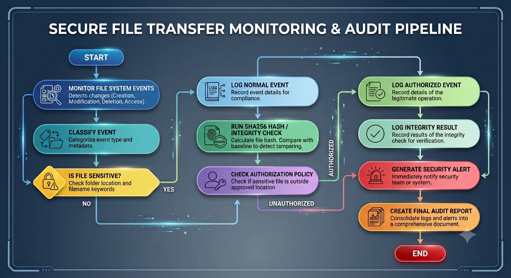

# Secure File Transfer Monitoring System

## Project Overview

The Secure File Transfer Monitoring System is a Python-based cybersecurity project designed to monitor file movement and detect suspicious file transfer activity.

This project focuses on identifying unauthorized movement of sensitive files, detecting file modification using SHA256 hash verification, and generating audit logs for security investigation.

## Architecture Diagram



The architecture shows how the system monitors file activity, classifies events, checks whether a file is sensitive, verifies integrity using SHA256 hashing, applies authorization policy, logs events, generates security alerts, and supports final audit reporting.

## Key Features

* Real-time file system monitoring
* File creation, modification, deletion, and movement detection
* Sensitive file detection using folder location and filename keywords
* Unauthorized sensitive file transfer alerts
* SHA256-based file integrity verification
* Hash mismatch detection
* Persistent audit log generation
* Evidence-based security testing with screenshots

## Security Goals

This project helps detect:

* Sensitive files copied or moved outside approved locations
* Unauthorized file movement
* File tampering or modification
* Suspicious file transfer behavior
* Possible data leakage or insider misuse

## Tools and Technologies Used

* Python
* Watchdog
* Hashlib
* Linux Terminal
* Python Virtual Environment
* GitHub

## Project Folder Structure

```text
secure-file-transfer-monitor/
├── src/
│   └── monitor.py
├── monitored-folder/
├── sensitive-data/
├── transfer-destination/
├── logs/
│   └── file-transfer-audit-log.txt
├── screenshots/
├── reports/
├── README.md
├── final-report.md
├── practical-journal.md
└── requirements.txt
```

## How the System Works

```text
START
↓
Monitor File System Events
↓
Classify Event
↓
Check Whether File Is Sensitive
↓
Run SHA256 Hash Verification
↓
Check Authorization Policy
↓
Log Normal Event or Generate Security Alert
↓
Store Audit Evidence
↓
END
```

## Detection Logic

The system treats a file as sensitive if:

* The file is inside the `sensitive-data/` folder
* The filename contains sensitive keywords such as:

  * confidential
  * secret
  * password
  * salary
  * employee
  * restricted

Sensitive files are only authorized inside:

```text
sensitive-data/
```

If a sensitive file appears inside:

```text
monitored-folder/
transfer-destination/
```

the system generates a critical unauthorized transfer alert.

## Integrity Verification

The system calculates a SHA256 hash for monitored files.

When a file is created, its hash is recorded.
When the file is modified, the new hash is compared with the old hash.

If the hash changes, the system generates:

```text
ALERT: Hash mismatch detected
```

## Sample Alerts

```text
ALERT: Sensitive file created
ALERT: Sensitive file modified
CRITICAL ALERT: Unauthorized sensitive file transfer detected
ALERT: Hash mismatch detected
```

## Project Outcome

The project successfully demonstrates how file transfer monitoring, sensitive file classification, hash-based integrity checking, and audit logging can help detect suspicious file movement and possible data leakage.
