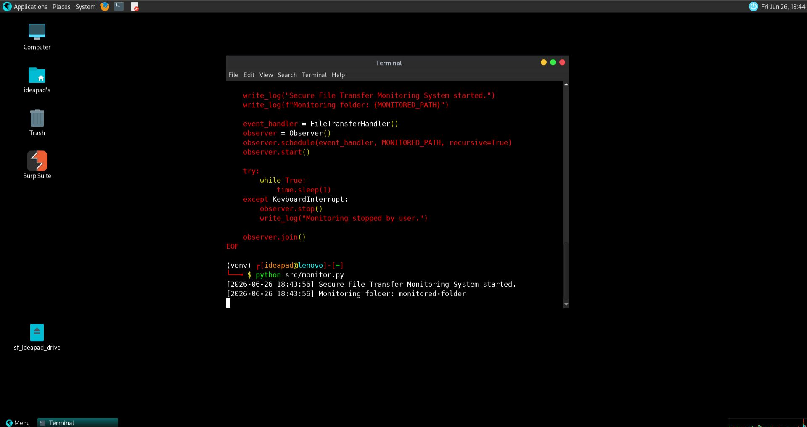
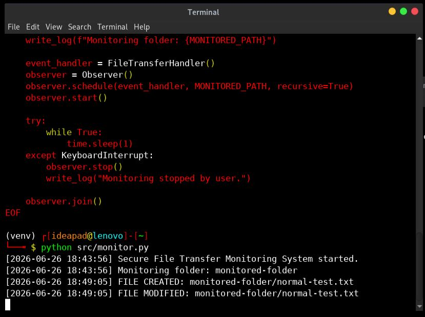
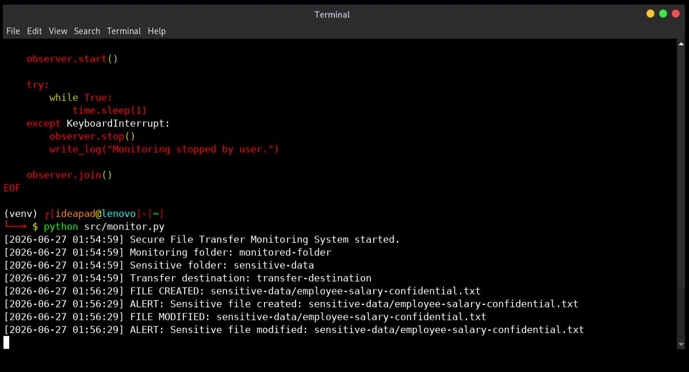
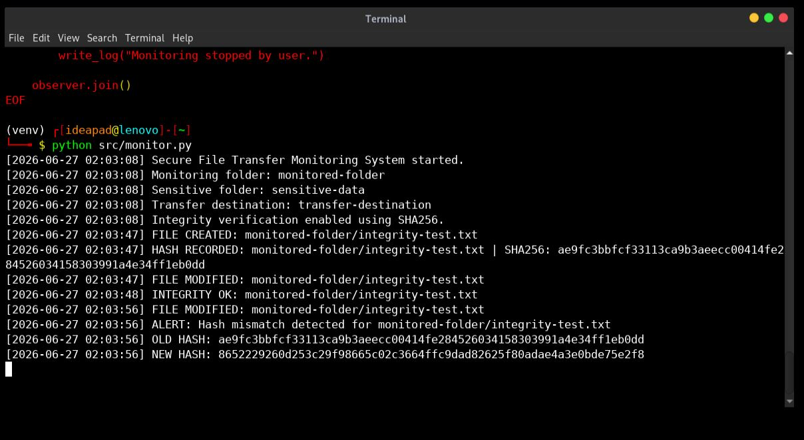
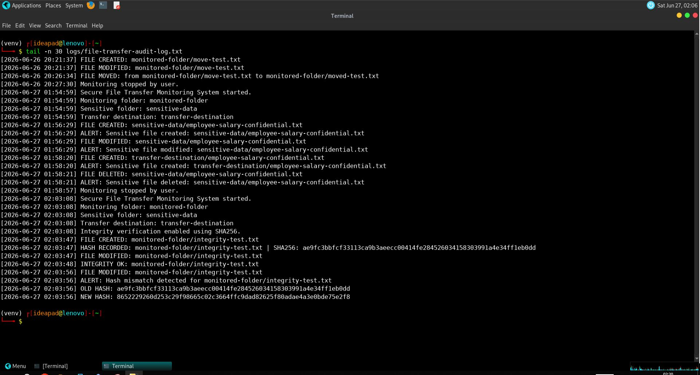
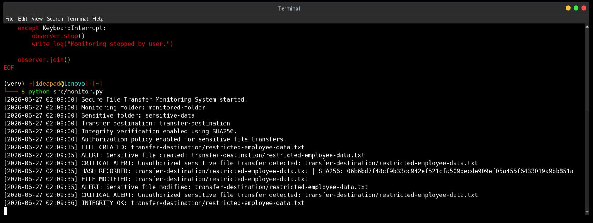
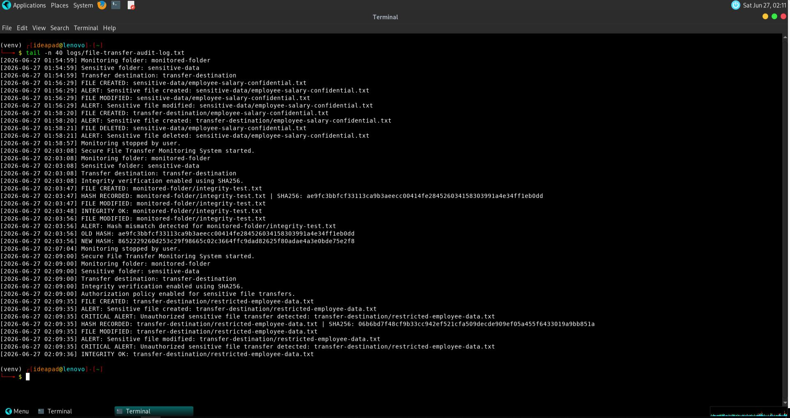
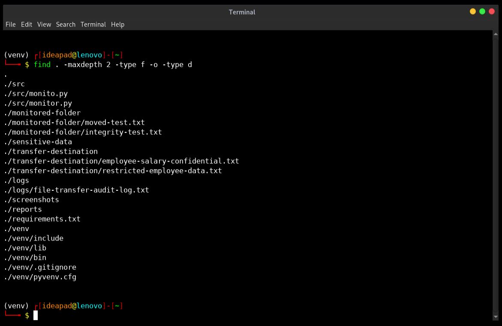

# Practical Journal — Secure File Transfer Monitoring System

## Project Title

Secure File Transfer Monitoring System

## Environment Used

```text
Linux VM / Parrot OS / Kali  → coding, testing, monitoring, logs, screenshots
Windows                     → documentation, reports, GitHub preparation
Python                      → monitoring script development
Watchdog                    → file system event monitoring
Hashlib                     → SHA256 integrity verification
```

## Practical Work Summary

This project was developed to monitor file movement and detect suspicious or unauthorized file transfer activity.

The monitoring system was built using Python and tested in a Linux environment. It detects file creation, modification, deletion, and movement events. It also identifies sensitive files, checks whether they are placed in authorized locations, calculates SHA256 hashes, and records audit logs.

## Step-by-Step Practical Work

### 1. Project Folder Structure Created

A clean project structure was created to separate source code, monitored folders, sensitive data, transfer destination, logs, screenshots, and reports.

### 2. Python Virtual Environment Configured

A Python virtual environment was created to isolate project dependencies from the system Python environment.

### 3. Watchdog Library Installed

The `watchdog` Python library was installed to monitor real-time file system events.

### 4. Basic File Monitoring Script Created

The first version of the script monitored file events such as:

* file created
* file modified
* file deleted
* file moved

The monitoring script was started successfully and began watching the configured folder.

**Evidence screenshot:**



### 5. Normal File Event Tested

A normal file was created, modified, moved, and deleted inside the monitored folder to confirm that the monitoring script detected basic file activity.

Evidence screenshot:



### 6. Sensitive File Detection Added

Sensitive file detection was added using:

* sensitive folder location
* filename keywords

Sensitive keywords used:

```text
confidential
secret
password
salary
employee
restricted
```

### 7. Sensitive File Alert Tested

A sensitive test file was created inside the `sensitive-data/` folder. The system generated alerts for sensitive file creation and modification.

Evidence screenshot:



### 8. SHA256 Integrity Verification Added

SHA256 hashing was added using Python’s `hashlib` library.

The system records the original hash of a file and compares it after modification.

### 9. Hash Mismatch Tested

A test file was created and then modified. The system detected that the SHA256 hash changed and generated a hash mismatch alert.

Evidence screenshot:



### 10. Audit Log Verified

The audit log was checked to confirm that file events, sensitive file alerts, hash values, and security alerts were permanently recorded.

Evidence screenshot:



### 11. Unauthorized Transfer Detection Added

An authorization policy was added to allow sensitive files only inside:

```text
sensitive-data/
```

Sensitive files appearing in other monitored locations were treated as unauthorized.

### 12. Unauthorized Sensitive File Transfer Tested

A restricted sensitive file was created inside the transfer destination folder. The system generated a critical unauthorized transfer alert.

Evidence screenshot:



### 13. Final Log Evidence Verified

The final audit log was checked to confirm that the critical unauthorized transfer alert was saved.

Evidence screenshot:



### 14. Final Project Structure Verified

The project structure was verified to confirm that all technical folders, source code, logs, and supporting files were organized correctly.

Evidence screenshot:



## Final Practical Outcome

The project successfully demonstrated:

* real-time file activity monitoring
* sensitive file detection
* unauthorized file movement detection
* SHA256 hash-based integrity checking
* hash mismatch alerting
* persistent audit log generation
* evidence-based cybersecurity reporting

## Conclusion

This practical project shows how Python can be used to build a lightweight file transfer monitoring system for detecting suspicious file movement, file tampering, and possible data leakage.
